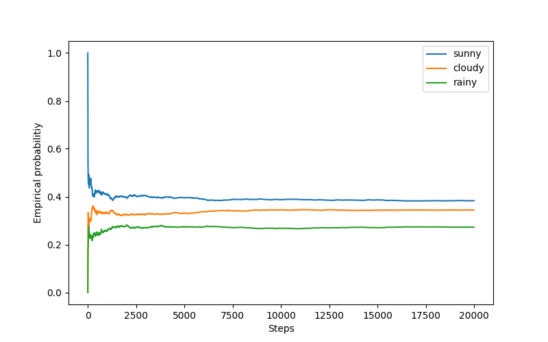
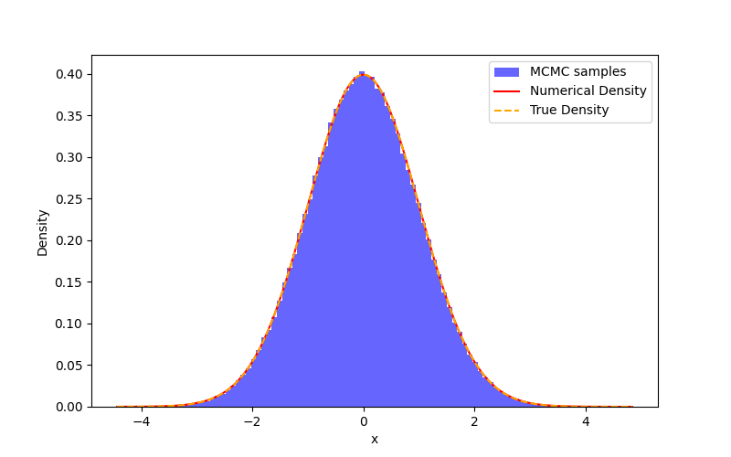

# Monte Carlo methods

## Monte Carlo Integration

```bash
$ python mc_integrator.py 
> Enter a function of x (e.g., x**2, np.sin(x), np.exp(x)): 
x**2
> Define limits of integration in format (upper, lower) (e.g. (0,1), (-1,1)):
(-1,1)
Integral of x**2 between (-1, 1) is 0.666697
```

## Markov Chain

Discrete 3 state Markov Chain example

```bash
python markov_chain.py
```



## Sampling through Markov Chain Monte Carlo

- MCMC for normal distribution

```bash
$ python mcmc_normal.py
```



- MCMC for Epanechnikov distribution

```bash
$ python mcmc_epanechnikov.py
```


